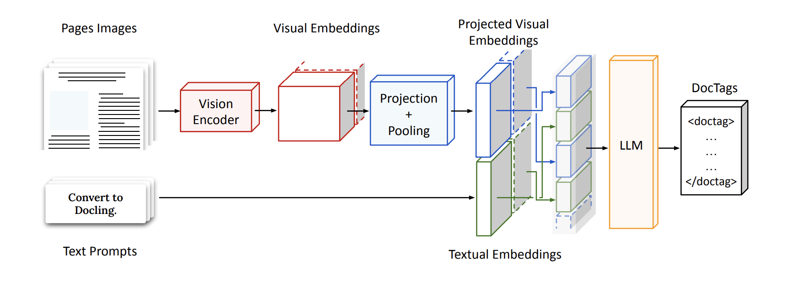

# Layout Recognition and Optical Character Recognition (OCR)

## Overview
This repository contains implementations for **Layout Recognition** and **Optical Character Recognition (OCR)** using a Transformer-based Vision-Language Model (VLM). The models process scanned documents to extract structured text with high accuracy.

## Features
- **Layout Recognition**: Identifies and categorizes document components such as paragraphs, tables, figures, and code.
- **OCR for Spanish Documents**: Extracts text from scanned Spanish documents with post-processing for normalization.
- **Transformer-Based Approach**: Uses a unified model for both vision and text, leveraging **SigLIP** as the vision backbone and **SmolLM-2** as the language backbone.
- **DocTags Format**: Structures extracted text into XML-like tags for improved document analysis.
- **Evaluation Metrics**: Includes IoU, mAP, WER, CER, BLEU, METEOR, and F1-score to assess model accuracy.

## Model Architecture
### Why Transformer-Based VLM?
- **Multi-modal Learning**: Integrates layout and textual information for superior results compared to CNN-RNN pipelines.
- **Efficient Feature Extraction**: Uses a **radical pixel shuffle method** to optimize tokenization.
- **Structured Output**: Generates DocTags-based output to preserve document structure.

### **Architecture**


## Implementation Details
### Layout Recognition Pipeline
1. **Preprocessing**
   - Converts PDF pages to image-text pairs.
   - Uses **DocTags** to label layout elements.
   - Cleans text using OCR-based normalization.
2. **Model Training**
   - **Step 1**: Freeze vision encoder, adapt LLM to DocTags format.
   - **Step 2**: Fine-tune the model using DocLayNet-PT, Docmatix, and SynthDocNet.
   - **Step 3**: Use curriculum learning for gradual adaptation.
3. **Inference**
   - Extracts text bounding boxes using **SmolDocling Processor**.
   - Converts results into structured DocTags.
   - Applies OCR error correction for improved accuracy.

### OCR Pipeline
1. **Training Approach**
   - Curriculum learning with vision-language alignment.
   - Uses **real-world scanned, web-scraped, and synthetic documents**.
   - Trains on diverse datasets like **DocLayNet-PT, WordScape, and PubTables-1M**.
2. **Post-Processing**
   - Removes OCR artifacts and normalizes punctuation using **spaCy**.
   - Corrects diacritics, unwanted special characters, and letter ambiguities.
   - Implements dictionary-based corrections.

## Evaluation Metrics
| Metric                     | Purpose |
|----------------------------|---------|
| **IoU (Intersection over Union)** | Measures bounding box accuracy. |
| **mAP (Mean Average Precision)** | Evaluates detection performance. |
| **CER (Character Error Rate)** | Checks OCR text accuracy at character level. |
| **WER (Word Error Rate)** | Measures word-level OCR accuracy. |
| **BLEU Score** | Evaluates OCR text quality using n-grams. |
| **METEOR Score** | Alternative translation-based text quality metric. |
| **F1-Score** | Assesses layout classification performance. |

## Usage
### Installation
Create a python virtual environment and then install the dependies
```bash
pip install -r requirements.txt
```

